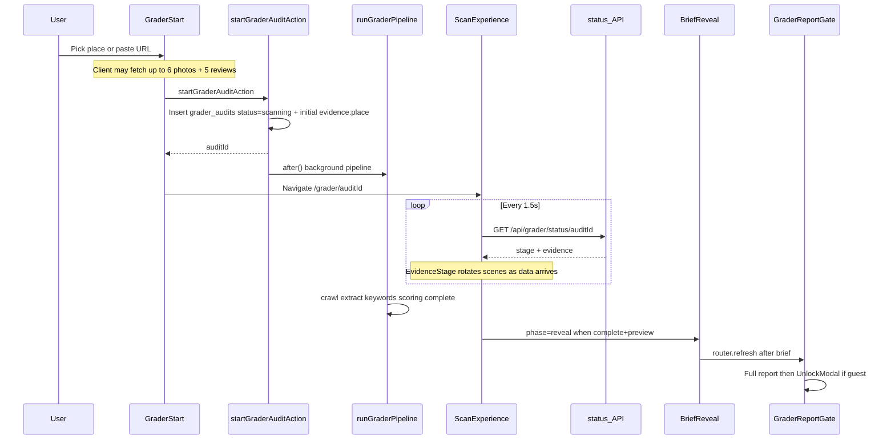

# Agent handoff — Grader progressive scan experience

**Purpose:** Brief another agent on what happens when a user kicks off a place/URL audit: names, sequence, files, and how to look it up in this repo.

**Product route:** `/grader` → `/grader/[auditId]`
**Canonical creative + data contract:** [grader-scan-experience.md](./grader-scan-experience.md)

---

## Vocabulary (use these names)

| Name | Meaning |
|------|---------|
| **Scan experience** / **progressive scan** | Full-page UX while the audit runs (`ScanExperience`) |
| **Evidence** / **evidence stage** | Live payload in `progress.evidence`, shown as scenes as data arrives |
| **Visibility Brief** / **brief reveal** | Score tease after scan completes (`BriefReveal`) |
| **Report gate** / **unlock gate** | Blurred full report + lead modal for guests |
| **scanSnapshot** | Persisted evidence copied onto the completed `AuditReport` |

Related UI pieces inside the scan:

| Name | Component / concept |
|------|---------------------|
| **EvidenceStage** | Rotates center scenes (~4.5s) from available evidence |
| **IdentityScene** | Place card, photo, rating, warnings, competitors |
| **ReviewsScene** | Stacked review cards (+ optional AI themes) |
| **PhotosScene** | Flying photo grid (up to 6 GBP photos) |
| **ScreenshotScene** | Homepage screenshot in desktop browser chrome |
| **SpeedScene** | PageSpeed gauges (not a phone) |
| **NarrationPanel** | AI lines from `evidence.narration` |

---

## What ships vs creative brief

| Topic | Reality in code |
|-------|-----------------|
| Owner-style phone frame | In [grader-scan-experience.md](./grader-scan-experience.md) storyboard only. **Not shipped.** |
| Photos / reviews during scan | **Shipped.** Shown as soon as `evidence.place.photoUrls` / `reviews` exist (often from client place details at kickoff). |
| Marketing `PhotoMarquee` | Unrelated homepage marquee — do not use for the grader scan. |
| Separate `/scan` + `ScanTool` | Different lead magnet (AI-readability). **Not** this funnel. |

Principle (brief + product): never fake loading. Every few seconds something real appears — their photos, reviews, homepage, competitors — then the brief, then the report, then the unlock gate for guests.

---

## End-to-end sequence



### Step-by-step

1. **Start** — User lands on `/grader` ([app/grader/page.tsx](../app/grader/page.tsx)).
   [components/grader/grader-start.tsx](../components/grader/grader-start.tsx) handles place autocomplete or URL.
   On place select, client `fetchPlaceDetails` can load **up to 6 photos + 5 reviews** before the server pipeline.
   Submit calls `startGraderAuditAction` → `router.push(/grader/${auditId})` (optional `?add=1`).

2. **Create + pipeline** — [app/actions/grader.ts](../app/actions/grader.ts)
   - Inserts `grader_audits` with `status: "scanning"` and `progress` (often already includes `evidence.place`).
   - `after(() => runGraderPipeline(...))` runs Firecrawl crawl, extract, keywords/competitors, PageSpeed (parallel), scoring.
   - Progress writer patches `grader_audits.progress` as stages complete (`place` → `crawl` → `extract` → `keywords` → `scoring` → `done`).

3. **Progressive UX** — Same URL [app/grader/[auditId]/page.tsx](../app/grader/[auditId]/page.tsx) renders `ScanExperience` while status is not `complete`.
   - Poll every ~1.5s: [app/api/grader/status/[auditId]/route.ts](../app/api/grader/status/[auditId]/route.ts).
   - UI: [components/grader/scan-experience.tsx](../components/grader/scan-experience.tsx) — scenes unlock as evidence fields appear; `EvidenceStage` rotates among them.
   - Motion CSS: [app/globals.css](../app/globals.css) (`grader-review-enter`, `grader-photo-enter`, etc.).

4. **Visibility Brief** — When poll returns `status === "complete"` + `preview`, UI switches to [components/grader/brief-reveal.tsx](../components/grader/brief-reveal.tsx) (~4.5s), sets `sessionStorage["grader-revealed:"+auditId]`, then `router.refresh()`.

5. **Report + unlock gate** — After refresh, the same route serves the full report:
   - [components/grader/report/report-gate.tsx](../components/grader/report/report-gate.tsx) (may replay brief for cold visits)
   - [components/grader/report/report-view.tsx](../components/grader/report/report-view.tsx) (blurs body when locked)
   - [components/grader/report/unlock-modal.tsx](../components/grader/report/unlock-modal.tsx) + [unlock-backdrop.tsx](../components/grader/report/unlock-backdrop.tsx)
   - Signed-in users skip the lead modal via `unlockGraderForSignedInUser` in `app/actions/grader.ts`.

---

## Types (must read)

[lib/grader/types.ts](../lib/grader/types.ts):

| Type | Role |
|------|------|
| `GraderProgressStage` | `"place" \| "crawl" \| "extract" \| "keywords" \| "scoring" \| "done"` |
| `GraderPlaceEvidence` | name, rating, `photoUrls[]`, `reviews[]`, address, etc. |
| `GraderProgressEvidence` | place, screenshotUrl, services, warnings, competitors, pageSpeed, reviewThemes, narration, photoBenchmark, gbpLookup, failureReason |
| `GraderProgress` | stage, stagesDone, startedAt, evidence, operatingModel?, auditTier? |
| `GraderReportPreview` | businessName, totalScore, grade, failedChecks, totalChecks, estimatedMonthlyLoss |
| `GraderStatusResponse` | progress fields + `status` + optional `preview` |
| `AuditReport.scanSnapshot` | `GraderProgressEvidence` after complete |

DB column: `grader_audits.progress` (jsonb) in [db/schema.ts](../db/schema.ts).

---

## File index

| Path | Role |
|------|------|
| [docs/grader-scan-experience.md](./grader-scan-experience.md) | Creative brief + data timeline contract |
| [app/grader/page.tsx](../app/grader/page.tsx) | Grader landing |
| [components/grader/grader-start.tsx](../components/grader/grader-start.tsx) | Place/URL start, early photos/reviews, kickoff action |
| [app/actions/grader.ts](../app/actions/grader.ts) | `startGraderAuditAction`, `runGraderPipeline`, progress writes, lead unlock |
| [app/grader/[auditId]/page.tsx](../app/grader/[auditId]/page.tsx) | Scan vs report branch; attaches `scanSnapshot` |
| [app/api/grader/status/[auditId]/route.ts](../app/api/grader/status/[auditId]/route.ts) | Poll payload for progressive UI |
| [components/grader/scan-experience.tsx](../components/grader/scan-experience.tsx) | Progressive scan UI + evidence scenes |
| [components/grader/brief-reveal.tsx](../components/grader/brief-reveal.tsx) | Visibility Brief |
| [components/grader/report/report-gate.tsx](../components/grader/report/report-gate.tsx) | Brief-before-report for cold links |
| [components/grader/report/report-view.tsx](../components/grader/report/report-view.tsx) | Full report; blur when locked |
| [components/grader/report/unlock-modal.tsx](../components/grader/report/unlock-modal.tsx) | Guest lead gate |
| [components/grader/report/unlock-backdrop.tsx](../components/grader/report/unlock-backdrop.tsx) | Blurred evidence behind modal |
| [lib/grader/types.ts](../lib/grader/types.ts) | Shared types |
| [lib/grader/reasoning.ts](../lib/grader/reasoning.ts) | Review themes, narration helpers, photo benchmark |
| [app/globals.css](../app/globals.css) | Review/photo enter animations |
| [db/schema.ts](../db/schema.ts) | `grader_audits.progress` |

---

## How to look this up in the repo

1. Read [grader-scan-experience.md](./grader-scan-experience.md) for intent and data timing.
2. Grep: `ScanExperience`, `GraderProgressEvidence`, `EvidenceStage`, `BriefReveal`, `scanSnapshot`.
3. Trace `startGraderAuditAction` → `runGraderPipeline` → progress writer in `app/actions/grader.ts`.
4. Trace poll loop in `scan-experience.tsx` → `app/api/grader/status/[auditId]`.
5. Trace complete branch in `app/grader/[auditId]/page.tsx` → `GraderReportGate` → unlock.
6. Do **not** use `/scan` + `ScanTool` as the reference — different product surface.

---

## Copy-paste instructions for the implementing agent

```
You are working on LocalMap / localsync-ai grader progressive scan UX.

Names to use:
- Scan experience / progressive scan (ScanExperience)
- Evidence / evidence stage (progress.evidence, EvidenceStage scenes)
- Visibility Brief / brief reveal (BriefReveal)
- Report gate / unlock gate (GraderReportGate, UnlockModal)
- scanSnapshot on AuditReport after complete

Kickoff flow:
1. /grader → grader-start.tsx → startGraderAuditAction
2. Redirect /grader/[auditId] → ScanExperience while status=scanning
3. Poll GET /api/grader/status/[auditId] every ~1.5s; show IdentityScene / ReviewsScene / PhotosScene / ScreenshotScene / SpeedScene as evidence arrives
4. On complete → BriefReveal → router.refresh → full report
5. Guests: blur + UnlockModal; signed-in: unlockGraderForSignedInUser skips modal

Read first:
- docs/grader-scan-experience.md
- docs/agent-handoff-grader-scan.md (this file)
- components/grader/scan-experience.tsx
- app/actions/grader.ts
- lib/grader/types.ts

Do not confuse with /scan ScanTool. Do not assume a phone mock is shipped (brief only). Photos and reviews already render from evidence.place when present.
```

---

## Follow-on (out of scope for this handoff)

Making the scan more Owner-like (photos/reviews dominate earlier, or adding a real phone scene) is a separate implementation against `scan-experience.tsx` + [grader-scan-experience.md](./grader-scan-experience.md). Do not invent a phone frame without an explicit product task.
