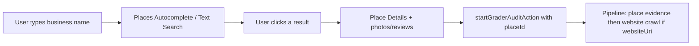

# Agent handoff — Google Places gate (no freeform URL audits)

**Purpose:** Brief another agent on how business lookup works today, what “Google Business Profile” means in this product, and how to **require a clicked Places result** before any grader crawl starts.

**Product route:** `/grader` (`GraderStart`) → `startGraderAuditAction` → `/grader/[auditId]`
**Related:** [agent-handoff-grader-scan.md](./agent-handoff-grader-scan.md), [grader-scan-experience.md](./grader-scan-experience.md), [phase-operating-model-routing.md](./phase-operating-model-routing.md)

---

## Vocabulary

| Name | Meaning |
|------|---------|
| **Places API (New)** | Google’s **public discovery** API: autocomplete, text search, place details, photos, reviews, `websiteUri`. Used for “find my business.” |
| **placeId** | Stable Google Place identifier. Proof the user picked a real Maps/GBP listing. |
| **GBP (Google Business Profile)** | The **public listing** customers see on Maps / Search. Same entity Places returns when you click a result. |
| **GBP API** | Separate **owner** API (OAuth + quota approval). Used later to *manage* a claimed profile — **not** used for the grader start gate. |
| **Places gate** | User must **search → click a suggestion** (or resolve URL **to** a place and confirm). No audit without `place.placeId`. |
| **website_local** | Current audit tier when someone starts with a URL and **no** place. **Target: remove / refuse** at the gate. |
| **full_local** | Audit tier when `placeId` is present — photos, reviews, competitors, GBP-shaped report. |

**Do not confuse:** Pasting `github.com/...` (or any random URL) is not a business lookup. The gate is “pick the Google listing,” not “paste any website.”

---

## How Google lookup works (product explanation)



1. Browser calls Places **Autocomplete** (and ranked **Text Search** fallbacks) with the existing LocalSync `NEXT_PUBLIC_GOOGLE_MAPS_KEY` (same creds as today — see **API credentials** below).
2. User **clicks** a row → client fetches **Place Details** (`places/{placeId}`) including name, address, rating, photos, reviews, `websiteUri`.
3. That payload is `GraderPlaceInput` — the gate artifact.
4. Server starts the audit with `place.placeId`. Website crawl uses `place.websiteUri` when present; **no-website** listings still grade (Maps/reviews/competitors).

**URL paste today (secondary path):** If the field looks like a URL, client/server try to **resolve hostname → Places text search → match `websiteUri`**. That is still a Places gate *when it succeeds*. Problem: non-storefront models can still submit **website-only** when resolve fails — that is how junk URLs enter the pipeline.

**GBP API is not this step.** Connecting Google later (OAuth) is for owners who manage listings inside the app. The grader gate only needs Places public data.

---

## Current code (as of this handoff)

| Behavior | Where | Today |
|----------|--------|--------|
| Autocomplete + click | [components/grader/grader-start.tsx](../components/grader/grader-start.tsx) | Shipped |
| Client place details (photos/reviews) | same → `fetchPlaceDetails` | Shipped |
| URL → place resolve | `resolveUrlToPlace` in grader-start + [lib/grader/place-lookup.ts](../lib/grader/place-lookup.ts) | Shipped |
| Storefront requires place | `requiresGbp` + [app/actions/grader.ts](../app/actions/grader.ts) `storefront && !placeId` | Shipped |
| Website-only for mobile / service_area / online | `canSubmitWebsiteOnly` + `auditTier: website_local` | **Allowed — product wants this closed** |

Types: [lib/grader/place.ts](../lib/grader/place.ts) (`GraderPlaceInput`).
Ranking helpers: [lib/grader/place-search.ts](../lib/grader/place-search.ts).

---

## Desired product rule

**Hard gate:** `startGraderAuditAction` accepts an audit **only if** `place?.placeId` is present.

- Primary UX: search business name → click Google result → confirmed place card → “Grade my business.”
- Optional: paste website **only as a finder** — must resolve to a place the user can confirm; if no match, show [BusinessNotFoundHelp](../components/grader/business-not-found-help.tsx) and **block submit**.
- Never start crawl/pipeline on a bare URL (GitHub, personal blog, etc.).
- Operating model can still label scope (storefront / mobile / …) but **must not** unlock website-only audits.
- If listing has no website: still allow start (`url` omitted; pipeline skips crawl / uses place-only path already in grader).

Copy direction:

- Placeholder: “Search your business name on Google”
- Error: “Select your business from Google so we can audit a real listing”
- Not-found: keep help for claiming / creating a GBP — do not offer “continue with website only”

---

## Implementation checklist (for the coding agent)

1. **UI — [components/grader/grader-start.tsx](../components/grader/grader-start.tsx)**
   - `canSubmit` = `Boolean(selectedPlace?.placeId)` only (drop `canSubmitWebsiteOnly`).
   - Placeholder / toast always Places-first (all operating models).
   - URL mode: keep resolve-to-place; on failure keep `notFound`, never enable submit.
   - After resolve success, still show the emerald place confirmation card before submit (already mostly true).

2. **Server — [app/actions/grader.ts](../app/actions/grader.ts) `startGraderAuditAction`**
   - Require `place?.placeId` for **all** operating models (not only storefront).
   - Remove / never return `website_local` from this entrypoint (or throw if somehow missing place).
   - Keep using `place.websiteUri` as crawl target when present.

3. **Docs / copy**
   - Update [grader-scan-experience.md](./grader-scan-experience.md) “URL-only mode” sections: deprecate as start path; place-required is the gate.
   - Note in [user-complete-flow.md](./user-complete-flow.md) A2: no website-only grader start.

4. **Do not**
   - Wire GBP OAuth into `/grader` start.
   - Fake placeIds.
   - Treat Maps Static API or Firecrawl URL scrape as a substitute for Places selection.
   - Break no-website businesses that **do** have a Place result.

5. **Verify**
   - Search “Owners Box” → click result → audit has photos/reviews early.
   - Paste `https://github.com/...` → no submit / not-found.
   - Paste a real business site that matches a listing → auto-select place → submit OK.
   - Place with no `websiteUri` → audit still starts (`full_local` / place-only stages).

---

## File index

| File | Role |
|------|------|
| [components/grader/grader-start.tsx](../components/grader/grader-start.tsx) | Autocomplete, URL resolve, submit gate |
| [lib/grader/place.ts](../lib/grader/place.ts) | `GraderPlaceInput` |
| [lib/grader/place-lookup.ts](../lib/grader/place-lookup.ts) | Server/client host → Places match |
| [lib/grader/place-search.ts](../lib/grader/place-search.ts) | Query variants + score |
| [app/actions/grader.ts](../app/actions/grader.ts) | `startGraderAuditAction`, tiers |
| [components/grader/business-not-found-help.tsx](../components/grader/business-not-found-help.tsx) | Empty / no-match UX |

---

## API credentials (reuse LocalSync — do not create new keys)

Use the **same Google Cloud / Maps credentials already wired for LocalSync** in `.env.local`. No new Places project, no new env var names, no duplicate browser keys.

| Env var | Used by | Role |
|---------|---------|------|
| `NEXT_PUBLIC_GOOGLE_MAPS_KEY` | `grader-start.tsx`, static map tiles | Client Places Autocomplete / Details / photos (referrer-restricted browser key) |
| `GOOGLE_MAPS_API_KEY` | `place-lookup.ts`, `local-competitors.ts` | Server Places calls when present (preferred over public key) |
| `GOOGLE_PLACES_API_KEY` | same server helpers | Optional alias; fall back only if set |

Resolution order on the server (already in code):
`GOOGLE_MAPS_API_KEY` → `GOOGLE_PLACES_API_KEY` → `NEXT_PUBLIC_GOOGLE_MAPS_KEY`.

**Do not:**

- Provision a second API key “for the gate”
- Rename env vars or invent `GRADER_PLACES_KEY`
- Call GBP OAuth client secrets (`GOOGLE_CLIENT_ID` / `GOOGLE_CLIENT_SECRET`) for this gate — those are for Connect later, not autocomplete

If lookup 403s, fix HTTP referrer / API restrictions on the **existing** key in Google Cloud (Places API New enabled on the LocalSync project), don’t add another key.

---

## Copy-paste agent instructions

```
Implement the Google Places gate for /grader.

Product rule: never start a grader audit without a clicked (or URL-resolved-and-confirmed) Google Places result with placeId. Remove website-only / website_local start paths for all operating models. URL paste may only help find a Place; if it does not resolve, block submit and show BusinessNotFoundHelp.

Credentials: reuse existing LocalSync Maps/Places env vars only (NEXT_PUBLIC_GOOGLE_MAPS_KEY + optional GOOGLE_MAPS_API_KEY / GOOGLE_PLACES_API_KEY). Do not create new API keys or env names.

Read docs/agent-handoff-places-gate.md and follow the implementation checklist. Touch grader-start.tsx and startGraderAuditAction first; update grader-scan-experience.md / user-complete-flow.md copy that still describes URL-only as a first-class start.

Do not add GBP OAuth to the grader start. Do not allow GitHub or arbitrary URLs to enter the pipeline. Keep place-only (no websiteUri) audits working.

Verify: real business name click works; github.com paste cannot submit; matching website URL resolves to place then submits.
```

---

## Quick answers

**“Is it part of Google Business Profile?”**
Yes in the customer sense: the listing on Google. Technically the gate uses **Places API** to select that listing’s `placeId`. Owner **GBP API** connect is a later, authenticated step.

**“Same as LocalSync lookup?”**
Yes — this repo already has that UX in `GraderStart`, on the **same** `NEXT_PUBLIC_GOOGLE_MAPS_KEY` / server Maps keys. The change is to **close the escape hatch** that lets non-storefront (and failed URL resolve) skip the clickable Google result.

**“Same API creds?”**
Yes. Gate + scan evidence + competitor search all use the existing LocalSync Google Maps/Places keys. No new credentials.
