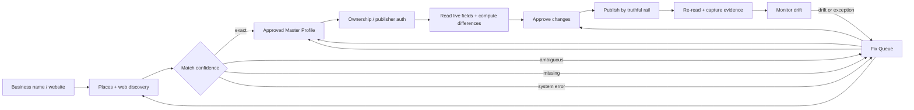

# Automation-first listings workflow

**North star:** onboarding creates one approved Master Profile, discovers the
business everywhere it can, and advances each publisher as far as its truthful
rail allows. A person enters only for confirmation, ownership, verification,
approval, or an external publisher exception.

## Google profile intake cases

| Discovery result | System decision | Customer experience | Fix Queue record |
|---|---|---|---|
| Exact Places result selected | Connect ownership | Confirm the profile, then authorize Google | `system:google-profile:connect` |
| Website match | Connect ownership | Confirm the matched address and phone | `system:google-profile:connect` |
| Name-only match | Require confirmation | Compare address, phone, and website | `system:google-profile:confirm-match` |
| No result | Prepare creation | Build the profile from approved Master Profile fields | `system:google-profile:create` |
| Customer says an existing profile was missed | Recover before creating | Search exact name, address, phone, website, and duplicates | `system:google-profile:recover` |
| Places configuration, quota, or upstream failure | Block discovery | Explain the system issue; never say the profile is missing | `system:google-profile:retry-lookup` |
| No audit context | Discover first | Search automatically after Master Profile creation | `system:google-profile:discover` |

Google profile creation is automated through preparation and workflow. Google
can still require an owner/manager login and verification before the public
profile can go live. LocalMap must not claim that verification was automatic.

## End-to-end pipeline



## Automation contract

1. **Discover:** Places finds the Google entity; website extraction finds social
   and directory URLs. Extraction failures remain system states, not business
   facts.
2. **Build:** the grader and onboarding prefill the Master Profile from Places,
   site content, category defaults, services, and prior audit evidence.
3. **Route:** core publishers apply broadly; Category Pack publishers apply only
   to matching categories.
4. **Connect:** direct publishers require customer authorization. Guided,
   manual, and audit-only publishers keep their honest rail labels.
5. **Compare:** live publisher data is normalized and diffed against the Master
   Profile.
6. **Approve:** no public change publishes without the configured approval rule.
7. **Deliver:** direct writes use publisher APIs; guided/manual rails create the
   smallest possible Fix Queue action with instructions and evidence.
8. **Verify:** `Live & synced` is granted only after a re-read confirms the live
   publisher matches. Submission alone is not success.
9. **Monitor:** scheduled checks turn drift, authentication expiry, duplicates,
   suspension, and verification problems into prioritized fixes.

## Current implementation truth

- Places autocomplete, text search, detail loading, website matching, and
  confidence ranking are live.
- Places errors and genuine empty results are now separate states.
- Onboarding creates the Master Profile, tracks publishers, claims the grader
  audit, and seeds audit findings into the Fix Queue.
- Google profile intake now seeds one idempotent next action for found,
  ambiguous, missing, disputed, unavailable, and no-context cases.
- Google OAuth import, profile diffing, verification state, and Clerk feature
  gates already exist.
- Direct Google writes and Google-created locations are not yet implemented;
  they depend on approved Business Profile API access and verification rules.
- Website listing discovery currently uses site links and Firecrawl. Nimble MCP
  is the intended higher-confidence extraction adapter for multi-source
  discovery and evidence gathering.
- Category Pack marketing/catalog data exists, but pack activation, publisher
  persistence, and the per-location Clerk add-on entitlement still need one
  shared implementation seam before they are production automation.

## Next implementation slice

Create a single publisher-orchestration module with this interface:

```ts
reconcileLocation(locationId): Promise<ReconciliationRun>
```

Its implementation should select core + category publishers, discover existing
profiles, compute field differences, create approval requests, execute direct
writes where authorized, create guided fixes elsewhere, and schedule evidence
verification. Callers should not need to know individual publisher behavior.
