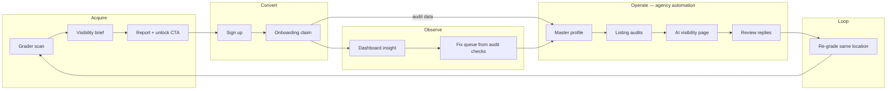

# Phase: Cyclical Funnel (Grader → Agency → Re-grade)

**Status:** Active — this is the primary phase. Operating-model routing (Gate A) is infrastructure; **this phase is the product.**

**North star:** Owner wins on “fix in minutes” with an **AI website they host on Owner**. LocalSync wins on **observability + approve-first automation** while the client **keeps their own website**. The grader is the emotional hook; the dashboard is the ongoing agency engine.

---

## Owner vs LocalSync (endpoint)

| | Owner.com | LocalSync / LocalMap |
|---|-----------|----------------------|
| **Hook** | Live scan (map, reviews, GBP card) | Visibility brief + honest audit |
| **Promise** | “Launch improvements” — new site | “Fix leaks” — master profile + listings + AI visibility |
| **End product** | AI website on their stack | Client’s website stays; we sync, audit, draft, approve |
| **Work left for client** | Tweak generated site | Approve drafts, paste listing URLs, connect Google |
| **Agency fit** | Competes with agencies | **Is** the agency automation layer |

We take Owner’s **beginning** (wow scan + urgency). We merge it with our **middle and end** (profile SSOT → listing audits → visibility page → review replies).

---

## The cycle (must be closed)

**Broken today (pre-bridge):** steps after `O` mostly ignore grader `checks`, `keywords`, and fix plan. User must reopen `/grader/[id]` to see what to fix.

**Fixed when this phase is done:** claim copies audit link + spawns **fix queue** in setup guide; dashboard CTA goes to **location work**, not re-onboarding.

---

## Data contract at claim

When `claimGraderAudit` runs, the location must receive:

| Field | Source | Used for |
|-------|--------|----------|
| `attributes.graderAuditId` | audit.id | Reverse lookup |
| NAP, website, description | extracted + form | Profile |
| `operatingModel`, `auditTier`, `gbpLinkedAtAudit` | progress + gbpProfile | Routing |
| *(read on demand)* `checks[]` | grader_audits | Fix queue steps |
| *(read on demand)* `keywords[]` | grader_audits | Dashboard + visibility context |
| *(future)* `extracted.services` | extracted | serviceSlugs |
| *(future)* `extracted.hoursSummary` | extracted | regularHours |

Checks stay on `grader_audits` (large jsonb) — **no duplicate store**. Location holds the pointer.

---

## Phase gates

### Gate 1 — Link & route ✅ (ship first)

- [x] `graderAuditId` on location at claim
- [x] `getGraderAuditForLocation(locationId)`
- [x] Dashboard “Continue fixing” → `/dashboard/locations/{id}` (not re-onboarding)
- [x] Setup guide includes grader-derived fix steps

### Gate 2 — Enrich claim

- [x] Map `extracted.services` → taxonomy slugs
- [x] Parse `hoursSummary` → `regularHours` when possible (raw summary stored otherwise)
- [x] Store `extracted.placeId` for GBP re-link (`googlePlaceId` attribute)
- [x] Location banner: audit score + leaks + report link
- [x] Re-run audit from location (pre-linked claim + profile pointer update)

### Gate 3 — Work queue

- [ ] Seed `manualTasks` from fix-plan quick wins
- [x] Location header: audit score + leaks via linked audit banner
- [ ] Keyword opportunities feed FAQ / visibility generation

### Gate 4 — Re-grade loop

- [x] Start grader from location (“Re-run visibility audit”)
- [x] Attach new audit to same location; update `graderAuditId` on complete
- [ ] Diff score on dashboard after re-grade
- [ ] Agency: per-client audit from Clients list

---

## Primary ICP path (script this demo)

**Agency adds HVAC client from grader:**

1. `/grader` → search business → scan → brief → report
2. Sign up → onboarding prefilled → location created + audit claimed
3. `/dashboard?audit=` → insight card shows leaks + keywords
4. “Continue fixing” → location setup guide with **audit fix steps** at top
5. Complete profile → run listing audit → publish visibility page
6. Show client `/grader/[id]` report + dashboard score improvement

**Lane B (no GBP):** same through step 2, then Google create + Premium CTA — no full wizard parity.

---

## File ownership

| Concern | File |
|---------|------|
| Bridge (SSOT) | `lib/grader/location-audit-bridge.ts` |
| Claim pointer | `lib/profile/operating-model-meta.ts`, `app/actions/onboarding.ts` |
| Fix steps in setup | `lib/profile/setup-workflow.ts` |
| Dashboard insight | `lib/grader/dashboard.ts`, `components/dashboard/recent-marketing-insight-card.tsx` |
| Routing after fix | `lib/onboarding/routing.ts` |

**Pause until Gate 1–2 are green:** four-bucket onboarding parity, model-specific report sections, per-model pipeline scoring.

See also: [`phase-operating-model-routing.md`](./phase-operating-model-routing.md) (infrastructure only).
