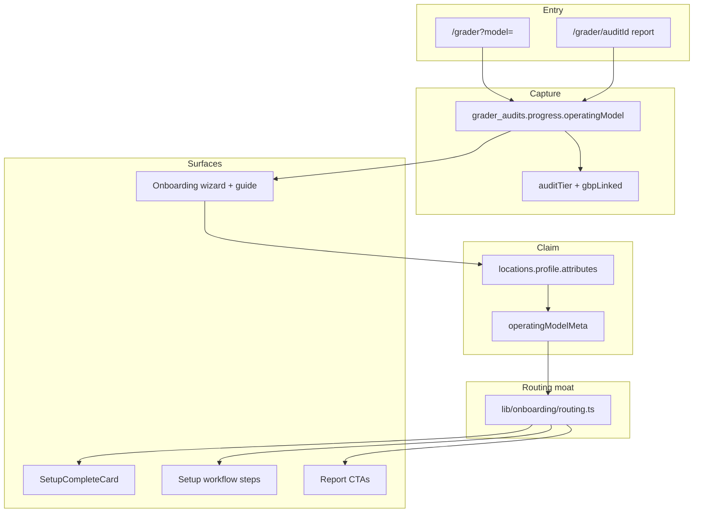

# Phase: Operating Model Routing Moat

**Status:** Phase 1 in progress — do not ship unrelated grader/marketing work until routing gates below are green.

**Goal:** Every user path is tailored by *how they operate* (storefront, mobile, service area, online-first). The model chosen at `/grader` survives claim and drives onboarding, dashboard setup, and fix CTAs — not just copy.

---

## Why this is the moat

Owner.com assumes brick-and-mortar + GBP always exists. LocalSync serves food trucks, home services, online-first local brands, and storefronts. The UX moat is:

1. **Honest scope** — never fake GBP or competitors.
2. **Branch early** — model before search.
3. **Route forever** — model on the location profile after claim.
4. **One router** — `lib/onboarding/routing.ts` is the single source for URLs and next-best-action.

---

## Area map (four buckets)

| Operating model | Primary identity | GBP at grader | Audit tier | Primary onboarding object |
|-----------------|------------------|---------------|------------|---------------------------|
| **storefront** | Fixed address + map pin | Required to start | `full_local` when place matched | Connect & sync GBP |
| **mobile** | Website + where-you-operate | Optional | `full_local` or `website_local` | Service area / events + website |
| **service_area** | Trade + cities served | Optional | `full_local` or `website_local` | Service-area GBP + zones |
| **online** | Website + local buyer story | Optional | Usually `website_local` | Website SEO + citations |

---

## Route matrix

| Entry | Params | Lands on | Carries model? |
|-------|--------|----------|----------------|
| Grader home | `/grader` | Model picker + search | In React state only |
| Grader deep link | `/grader?model=mobile` | Preselected model | Query → state |
| Scan running | `/grader/[auditId]` | Scan → brief → report | On `progress.operatingModel` |
| Fix CTA (signed in) | `/dashboard/onboarding?auditId=&intent=fix` | Guide + wizard | Prefill from audit |
| Fix CTA (signed out) | `/sign-up?audit=` → onboarding | Same | Prefill from audit |
| Setup complete | `/dashboard/onboarding?done=1&location=` | Model-aware CTAs | From location profile |
| Dashboard home | `/dashboard?audit=` | Setup compact + insight | From location profile |

**Intent values** (`intent` query param):

| Intent | Meaning | Primary next step |
|--------|---------|-------------------|
| `fix` | Came from grader report CTA | Model-aware connect / GBP create |
| *(default)* | Organic onboarding | Standard profile steps |

---

## System diagram

---

## Phase gates (do not advance until checked)

### Gate A — Capture & persist ✅ target Phase 1

- [x] Model picker on grader start (4 cards)
- [x] `operatingModel` + `auditTier` on audit progress
- [x] Prefill from audit into onboarding
- [x] **Persist model on location at claim** (`profile.attributes`)
- [x] **Central router** (`lib/onboarding/routing.ts`)

### Gate B — Entry & exit URLs ✅ target Phase 1

- [x] `/grader?model=` deep links
- [x] `intent=fix` wired in report CTAs → post-setup actions
- [x] Google create + Premium links on not-found
- [ ] Premium checkout handoff with model tracking (Phase 2)

### Gate C — Onboarding parity 🔄 Phase 1–2

- [x] Operating model guide (copy checklist)
- [x] Model-specific wizard fields (service area cities)
- [ ] Full wizard branch per model (hide address, mobile locations)
- [ ] Model-specific report sections (not just `GbpMissingCard`)

### Gate D — Dashboard moat 🔄 Phase 2

- [x] Model-aware setup workflow steps (connect phase)
- [ ] Dashboard banner keyed to model + GBP status
- [ ] `/dashboard/connect` copy per model
- [ ] Publisher pack defaults per model (food truck vs home services)

### Gate E — Pipeline honesty 🔄 Phase 2

- [ ] Scoring weights differ by model (optional address, service area keywords)
- [ ] `auditTier` respects model when place is optional
- [ ] Competitor probe uses vertical + model context

---

## File ownership

| Concern | File |
|---------|------|
| **Router (SSOT)** | `lib/onboarding/routing.ts` |
| Profile meta read/write | `lib/profile/operating-model-meta.ts` |
| Model setup steps | `lib/profile/model-setup-steps.ts` |
| Path copy / checklists | `lib/onboarding/operating-model-paths.ts` |
| Grader entry | `components/grader/grader-start.tsx`, `app/grader/page.tsx` |
| Not-found UX | `components/grader/business-not-found-help.tsx` |
| Report CTAs | `components/grader/report/ctas.tsx` |
| Claim + prefill | `lib/grader/claim.ts`, `app/actions/onboarding.ts` |
| Setup workflow | `lib/profile/setup-workflow.ts` |
| Complete screen | `components/onboarding/setup-complete-card.tsx` |

---

## Marketing deep links (ready to use)

| Audience | URL |
|----------|-----|
| Food trucks / mobile | `/grader?model=mobile` |
| Home services | `/grader?model=service_area` |
| E-commerce / local online | `/grader?model=online` |
| Retail / restaurant | `/grader?model=storefront` |

---

## Definition of done (Phase 1)

Phase 1 is complete when:

1. A user can land on `/grader?model=service_area`, run a website-only audit, sign up, and see **service-area-specific** setup complete CTAs.
2. `operatingModel` is on their location profile after onboarding.
3. Dashboard setup guide includes **model-specific connect steps** (e.g. “Create Google listing” when GBP was missing at audit).
4. All fix CTAs use `routing.ts` — no duplicated URL strings.

**Only after Gate A–B are green** should we resume grader scoring tweaks, new vertical packs, or marketing pages.
