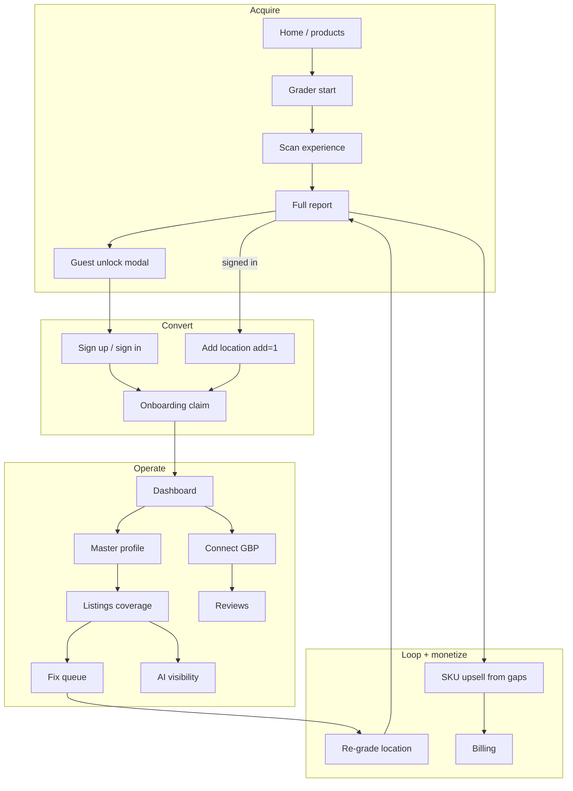

# Complete user flow map — dropouts & UX fills

**Purpose:** End-to-end paths through LocalMap, where people fall out, and how we close each gap with product UX (not more marketing copy).

**Related:** [product-funnels.md](./product-funnels.md), [phase-cyclical-funnel.md](./phase-cyclical-funnel.md), [pricing-and-offerings.md](./pricing-and-offerings.md)

**North star for the user:** Every screen answers *what just happened*, *what’s next*, and *what LocalMap is doing for me*. Linked work rises; incomplete work is an honest next step — never a dead end or a re-ask.

---

## Personas & jobs

| Persona | Job to be done | Primary path |
|---------|----------------|--------------|
| **Hunter** (anon) | “How bad is my visibility?” | Home / product → Grader → unlock → signup → claim |
| **Owner** (signed in) | “Fix my place and keep it fixed” | Dashboard → location → listings → tasks → re-grade |
| **Agency** | “Add clients fast; prove value; hand off later” | Org → Clients → audit `?add=1` → listings → digest |
| **Buyer** | “Is this worth Premium / Pro?” | Pricing / product → audit proof → billing |

---

## Master flow (all paths)

---

## Path A — Hunter (anonymous first audit)

| Step | Screen | Happy | Dropout | UX fill |
|------|--------|-------|---------|---------|
| A1 | `/` or `/products/*` | “Run free audit” | Product over-promises sync | CTA always → `/grader`; honest rail badges on product pages |
| A2 | `/grader` | Pick a verified place match | Places unavailable / ambiguous / genuinely missing | Separate system errors from empty search; exact-name + city recovery; automated profile-setup path when genuinely missing |
| A3 | Scan | Progress + brief | Crawl / AI / timeout fail | Human error + Retry + “continue with what we have” when partial |
| A4 | Report blurred | Unlock Step 1–2 | Feels like a trap | Keep for hunters; show score peek so value is visible |
| A5 | Unlock opt-in | Checkbox | SMS never ships | Relabel to email updates **or** remove until Resend digest lives |
| A6 | Sign up | `?audit=` preserved | Lost audit context | Always thread `auditId` through Clerk redirect |
| A7 | Onboarding claim | Prefill from audit | Re-ask NAP / account type | Prefill hard; skip account type if org already exists |
| A8 | Setup complete | Open fix queue | External “Add to Google” leaves app | In-app Connect card + return deep-link |

**Success definition:** Hunter lands on Tasks with 3–5 grader-derived fixes and a “Link Yelp / Facebook” next-best listings prompt.

---

## Path B — Signed-in expander (2nd / 3rd / Nth location)

| Step | Screen | Happy | Dropout | UX fill |
|------|--------|-------|---------|---------|
| B1 | Dashboard / switcher | “Run visibility audit” | Goes to `/grader` without `add=1` | **Always** `/grader?add=1` from org context |
| B2 | Scan → report | Auto-unlocked | Still sees unlock modal | Keep signed-in skip (`unlockGraderForSignedInUser`) |
| B3 | CTA | “Add to workspace” | “Start fixing” feels like first-run | Workspace-aware CTA only |
| B4 | Onboarding | Create new location | Link-to-existing picker confuses | `preferCreateNew`; optional owner vs **client** once |
| B5 | New location | Switcher shows new name | Header still old org label | Header = selected location (done); toast “Owners Box added” |

**Success definition:** Second business feels like *attach*, not *signup again*.

---

## Path C — Owner operate (day 2+)

| Step | Screen | Happy | Dropout | UX fill |
|------|--------|-------|---------|---------|
| C1 | Dashboard | Insight + Continue fixing | Insight ignores audit | Always show linked audit score + top failed check |
| C2 | MBP tabs | NAP / hours / services | Empty tabs, no priority | Tab badges from open tasks (“Hours · 1 fix”) |
| C3 | Listings | Find links → Watching vs Still open | Flat grid, unknown forever | Coverage meter + Next 2 + linked sort (in progress) |
| C4 | Run listing audit | Findings | No path to fix | Finding → task or MBP field deep-link |
| C5 | Tasks | Check off | Tasks don’t close cycle | Completing task suggests “Re-grade when ready” |
| C6 | Connect Google | OAuth | Quota pending dead-end | “Connected · API pending — still audit listings & MBP” + guided checklist |
| C7 | Visibility | Publish `/l/[id]` | Orphan page | CTA from listings “Get AI citations” when coverage ≥ 3 |
| C8 | Reviews | AI drafts | Demo-only without GBP | “Preview with sample reviews” + clear Pro / GBP gate |
| C9 | Re-grade | Same location | Starts brand-new audit | “Re-run for {location}” prefilled from location banner |

**Success definition:** Operate loop never requires leaving the location chrome except billing / team.

---

## Path D — Agency operate

| Step | Screen | Happy | Dropout | UX fill |
|------|--------|-------|---------|---------|
| D1 | Agency onboarding | Name + first client | Same as owner wizard | Agency copy: “Add first client location” |
| D2 | Clients | Per-client locations | “All locations” unscoped | Filter locations by clientId |
| D3 | Add client | Grader `?add=1` | Relationship never stored on location | Optional **Yours / Client** on attach → handoff later |
| D4 | Rollup | Org health | No multi-location score | Dashboard: “2 healthy · 1 at 16/20” |
| D5 | Handoff | Invite owner | Missing | Provider locations: “Invite business owner” email |

---

## Path E — Monetize (without breaking trust)

| Trigger | Dropout | UX fill |
|---------|---------|---------|
| Listings coverage stuck | “Sync majors” banner with no proof | After 2+ linked: soft Premium — “Push NAP once instead of paste forever” |
| Review themes in grader | No Pro path | Report + Reviews: “AI reply drafts in Pro” |
| AI visibility score low | Feature buried | Task + listings CTA → `/visibility` |
| Pricing page | Sign-up with no audit | Pricing CTA: “Audit first (free)” then billing |
| Billing disabled | Dead upgrade | Soft waitlist or “Talk to us” if Clerk billing off |

Honest rails always: never sell API sync for `audit_only` publishers without labeling.

---

## Cross-cutting dropouts (whole app)

| Dropout | Where | Fill |
|---------|-------|------|
| **No next action** | Publishers registry, audit-already-claimed, quota pending | Every screen: primary CTA + secondary escape |
| **Re-asking identity** | Unlock + onboarding + relationship | Guests only for unlock; signed-in inherit; relationship on attach |
| **Context loss** | Org switcher, new audit, Clients → Locations | Preserve `locationId` / `clientId` / `auditId` in URLs |
| **Over-promise** | Marketing vs seed rails | Match product badges to `publishers.rail` |
| **Magic not credited** | Auto-link, audit, drafts | Toast + status: “LocalMap linked / found / drafted…” |
| **Incomplete env** | Firecrawl / AI / Places | Fail soft with config-specific copy (already partly done) |
| **Social gaps** | Instagram not in registry | Add Instagram (and YouTube) as manual/audit_only publishers |
| **SMS theater** | Unlock checkbox | Email digest or remove |

---

## Ideal “complete” journey (one location)

1. Discover LocalMap → free grader
2. Unlock (guest) or skip (signed in)
3. Claim into org → MBP prefilled
4. **Find links on website** → Watching list grows
5. Link Next 2 directories → Run listing audit
6. Clear Tasks from grader + listing findings
7. Connect Google (even if quota pending — still useful later)
8. Publish AI visibility page
9. Re-grade → score up → celebrate + soft upsell
10. Agency: invite owner / add next client

If any step has no CTA to the next, it is a bug.

---

## Priority to close dropouts (ship order)

| P | Gap | Why |
|---|-----|-----|
| P0 | Signed-in add flow never re-asks unlock / first-run | Trust |
| P0 | Listings: linked state, sort, next-best, Find links | Operate magic |
| P1 | Every dashboard dead-end gets a next CTA | Completion |
| P1 | Re-grade from location (not blank grader) | Loop closure |
| P1 | Clients scoped locations | Agency |
| P2 | Owner vs client on attach + handoff stub | Agency expansion |
| P2 | Email score digest (Resend) | Retention |
| P2 | Instagram (+ social) in publisher registry | Coverage |
| P3 | Product ↔ audit deep links for SKUs | Monetize |
| P3 | Quota-pending Connect education | GBP wait |

---

## Screen → next-action checklist (definition of done)

A path is “filled” when each screen has:

1. **Status** — what LocalMap already did
2. **Progress** — coverage / score / tasks left
3. **Primary CTA** — one obvious next
4. **Escape** — dashboard / other location / grade another (signed-in safe)

Use this checklist in PR review for any new dashboard or grader surface.
